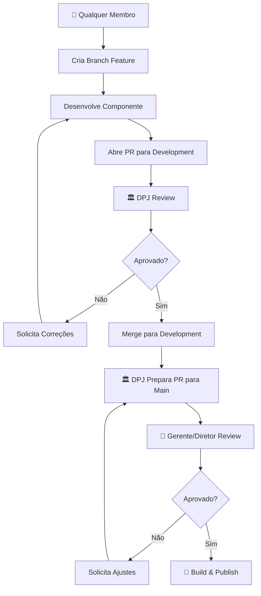

# byron.lib

Uma biblioteca de componentes React moderna e elegante construída com TypeScript, Tailwind CSS e Storybook.

## 📦 Instalação

### Instalar via npm

```bash
npm install @dpjbsol/byron.lib
```

### Configuração do Registry (GitHub Packages)

Esta biblioteca é publicada no GitHub Packages. Configure seu `.npmrc`:

```bash
# .npmrc
@dpjbsol:registry=https://npm.pkg.github.com/
```

## 🚀 Uso Básico

### Importar Componentes

```tsx
import { Button } from "@dpjbsol/byron.lib";
```

### Exemplo de Uso

```tsx
import React from "react";
import { Button } from "@dpjbsol/byron.lib";

function App() {
  return (
    <div>
      <Button onClick={() => alert("Clicou!")}>Clique em mim</Button>
    </div>
  );
}

export default App;
```

## 🛠️ Configuração

### Tailwind CSS

Esta biblioteca usa Tailwind CSS. Certifique-se de que seu projeto tenha o Tailwind configurado e importe os estilos da biblioteca no arquivo de estilização raiz (globals.css ou index.css):

```tsx
// src/globals.css ou src/index.css
import "@dpjbsol/byron.lib/styles";
```

### TypeScript

A biblioteca inclui definições de tipos TypeScript. Não é necessária configuração adicional.

## 📚 Storybook

### Executar o Storybook Localmente

Para visualizar e interagir com os componentes:

```bash
# Clone o repositório
git clone https://github.com/dpjbsol/byron.lib.git
cd byron.lib

# Instale as dependências
npm install

# Execute o Storybook
npm run storybook
```

O Storybook será executado em `http://localhost:6006`

## 🔧 Desenvolvimento

### Pré-requisitos

- Node.js 18+
- npm ou yarn

### Setup do Ambiente

```bash
# Clone o repositório
git clone https://github.com/dpjbsol/byron.lib.git
cd byron.lib

# Instale as dependências
npm install
```

### Scripts Disponíveis

- `npm run dev` - Inicia o servidor de desenvolvimento
- `npm run build` - Constrói a biblioteca para produção
- `npm run lint` - Executa o linter ESLint
- `npm run preview` - Preview da versão construída
- `npm run storybook` - Executa o Storybook
- `npm run build-storybook` - Constrói o Storybook para produção

### Estrutura do Projeto

```
byron.lib/
├── src/
│   ├── components/          # Componentes da biblioteca
│   │   ├── Button/         # Componente Button
│   │   │   ├── index.tsx   # Implementação do componente
│   │   │   └── Button.stories.tsx  # Stories do Storybook
│   │   └── index.ts        # Exports dos componentes
│   ├── lib.ts              # Entry point da biblioteca
│   └── index.css           # Estilos globais
├── .storybook/             # Configuração do Storybook
├── dist/                   # Build da biblioteca
└── package.json
```

## 🤝 Contribuindo

### Como Contribuir (Todos os Membros)

**Todos os membros** da byron podem contribuir com o desenvolvimento da biblioteca. O processo varia conforme o nível de responsabilidade:

#### 👥 Para Todos os Membros (Desenvolvedores)

1. **Clone** o repositório oficial:

   ```bash
   git clone https://github.com/dpjbsol/byron.lib.git
   cd byron.lib
   ```

2. **Instale** as dependências:

   ```bash
   npm install
   ```

3. **Crie** uma branch seguindo o padrão GitFlow para cada novo componente:

   ```bash
   # Para novos componentes
   git switch development
   git pull origin development
   git switch -c feature/component-nome-do-componente

   # Para correções
   git switch -c fix/correcao-especifica

   # Para hotfixes
   git switch main
   git switch -c hotfix/correcao-critica
   ```

4. **Desenvolva** o componente seguindo os padrões estabelecidos

5. **Execute** os testes e validações:

   ```bash
   npm run lint
   npm run build
   npm run storybook
   ```

6. **Commit** suas mudanças usando conventional commits:

   ```bash
   git commit -m "feat(component): adiciona componente Button"
   git commit -m "fix(button): corrige estilo hover"
   git commit -m "docs(readme): atualiza documentação"
   ```

7. **Push** para sua branch:

   ```bash
   git push origin feature/component-nome-do-componente
   ```

8. **Abra** um Pull Request para `development` e aguarde a **avaliação pelos membros da DPJ**

#### 🏛️ Responsabilidades da DPJ (Membros da Diretoria de Projetos)

**Todos os membros da DPJ** são responsáveis por:

- ✅ **Revisar e aprovar PRs** submetidos para a branch `development`
- 🔍 **Avaliar qualidade do código** e aderência aos padrões
- 📋 **Preparar PRs** da `development` para a `main` quando houver funcionalidades prontas
- 🎯 **Garantir** que todos os testes passem antes do merge
- 📝 **Documentar** adequadamente as mudanças

**Processo de Aprovação para Development:**

1. Receber PR de qualquer membro
2. Fazer code review detalhado
3. Solicitar correções se necessário
4. Aprovar e fazer merge para `development`
5. Preparar release notes quando aplicável

#### 👑 Responsabilidades de Gerentes/Diretores DPJ

**Apenas Gerentes e Diretores da DPJ** podem:

- ✅ **Aprovar PRs** da `development` para a `main`
- 🚀 **Executar o processo** de build, versionamento e publicação
- 📦 **Fazer deploy** oficial da biblioteca
- 🏷️ **Gerenciar releases** e tags de versão

#### ⚙️ Fluxo de Trabalho Resumido



### Padrões de Desenvolvimento

- **TypeScript**: Todos os componentes devem ser tipados
- **ESLint**: Siga as regras de linting configuradas
- **Storybook**: Cada componente deve ter suas stories
- **Commits**: Use conventional commits (feat, fix, docs, etc.)
- **GitFlow**: Siga rigorosamente o fluxo de branches
- **Code Review**: Todo código deve passar por revisão da DPJ

### Adicionando Novos Componentes

1. Crie uma branch específica: `feature/component-nome-do-componente`
2. Crie uma pasta em `src/components/NomeDoComponente/`
3. Adicione o arquivo `index.tsx` com o componente
4. Crie `NomeDoComponente.stories.tsx` para o Storybook
5. Exporte o componente em `src/components/index.ts`
6. Adicione documentação completa no Storybook
7. Execute todos os testes e validações
8. Submeta PR para `development` para avaliação

## 🚀 Deploy e Publicação

### 🏛️ Preparação do Release (Membros DPJ)

**Todos os membros da DPJ** podem preparar releases da `development` para `main`:

#### Processo de Preparação

1. **Verificar** se todas as funcionalidades em `development` estão prontas para produção
2. **Executar** testes completos:
   ```bash
   npm run lint
   npm run build
   npm run storybook
   ```
3. **Preparar** release notes documentando todas as mudanças
4. **Criar** Pull Request da `development` para `main`
5. **Aguardar** aprovação dos Gerentes/Diretores

### 👑 Aprovação e Publicação (Gerentes/Diretores DPJ)

Esta seção é exclusiva para **Gerentes e Diretores de Projetos** da DPJ que são responsáveis pelo processo final de aprovação, build, versionamento e publicação da biblioteca.

#### Processo de Release para Production

1. **Merge para Main**: Após aprovação em `development`, faça o merge para `main`:

   ```bash
   git checkout main
   git pull origin main
   git merge development
   ```

2. **Build do Projeto**:

   ```bash
   npm run build
   ```

3. **Incremento de Versão**: Escolha o tipo de incremento baseado nas mudanças:

   **Para mudanças menores/patches:**

   ```bash
   npm version patch  # 1.0.0 → 1.0.1
   ```

   **Para novas funcionalidades:**

   ```bash
   npm version minor  # 1.0.0 → 1.1.0
   ```

   **Para mudanças breaking:**

   ```bash
   npm version major  # 1.0.0 → 2.0.0
   ```

4. **Publicação**:

   ```bash
   npm publish
   ```

5. **Push das tags**:
   ```bash
   git push origin main --tags
   ```

#### Checklist de Release

- [ ] Todos os PRs aprovados e mergeados em `development`
- [ ] Build funcionando corretamente
- [ ] Storybook atualizado
- [ ] Documentação atualizada
- [ ] Versão incrementada corretamente
- [ ] Publicação realizada com sucesso
- [ ] Tags enviadas para o repositório

## 🐛 Reportar Bugs

Encontrou um bug? [Abra uma issue](https://github.com/dpjbsol/byron.lib/issues) no GitHub.

---

Um oferecimento Produção - DPJ 💙
